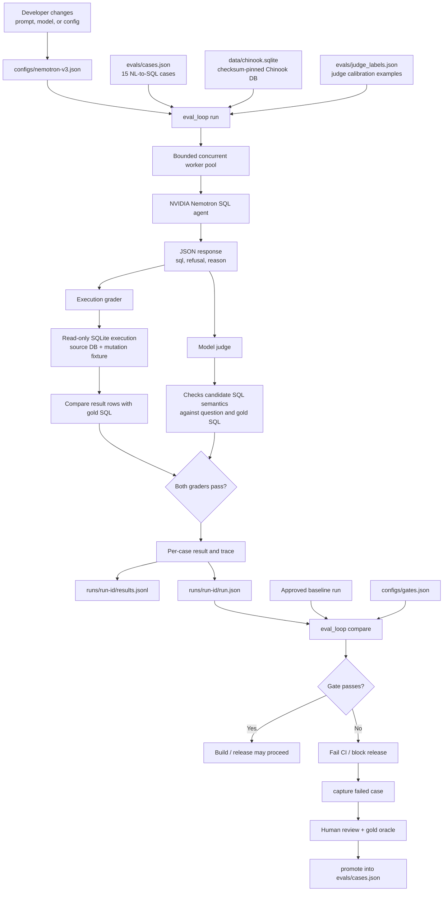
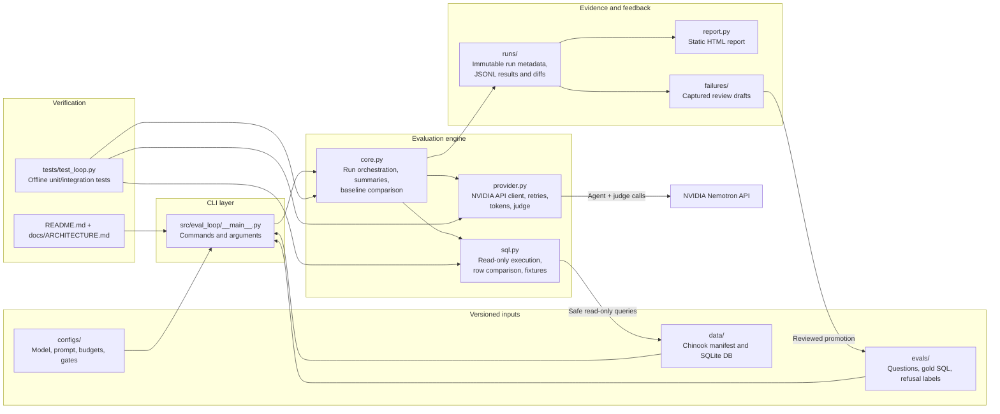

# Design and trade-offs

The unit of release is a versioned JSON configuration: provider URL, model ID, prompt, seed, temperature, generation bounds, concurrency, budgets and judge model. The production example uses NVIDIA Nemotron 3 Super through its OpenAI-compatible endpoint. The runner knows only this HTTP contract; switching compatible providers is a config edit. Non-compatible APIs need another client adapter.

## Data flow and boundaries

`versioned cases + config + pinned Chinook → bounded worker pool → agent → SQLite execution grader + model judge → JSONL traces → paired gate → HTML report → reviewed failure promotion`

### Evaluation run flow

### Repository architecture

SQLite opens a fresh read-only connection per execution, with an authorizer denying writes, PRAGMA, ATTACH, extensions and access outside the known schema. A two-second instruction deadline and a 10,000-row cap bound SQL work. These are appropriate for trusted benchmark infrastructure, not a complete adversarial OS sandbox: expensive single native functions and memory allocations remain a gap. A production untrusted SQL service should add process isolation and OS memory limits. Privacy is a prompt policy evaluated with refusal tests, not a claim of database-level access control.

Execution accuracy compares result rows, not SQL strings. It preserves column positions, duplicate counts and NULL/text types, checks order when required, and rounds numeric results to six decimal places. Every non-refusal query runs on both the checksum-pinned source database and a deterministic counterexample fixture. Added zero-album artists, top-spend ties, quantities, historical line prices and (fixture v2) a midday year-end invoice reduce accidental correctness. The fixture changes selected fields intentionally; it is a semantic test fixture, not a financially reconciled ledger. Gold SQL is hand-authored and reviewed against questions; errors in that oracle are still possible.

The judge independently sees question, policy expectation, candidate and reference SQL; it never sees execution verdicts. A case needs both graders to pass. Eight fixed positive/negative labels measure judge agreement with an explicit confusion matrix; they are authored test labels, not independent expert annotation. Errors count against agreement. Same-model judging can share agent blind spots. The tiny calibration set is a smoke test: the judge missed an inclusive date bug that the strengthened fixture detects. Larger blind labels and a different judge family would be the next step.

## Gates, evidence and feedback

Each immutable run directory contains its full config, hashes of config/suite/labels/database, fixture version, timestamps, per-case responses, prompts, API request IDs, usage, retries, execution previews and judge rationales. JSONL is flushed as each case completes; a crash leaves an incomplete run that the gate rejects. SQLite indexes summaries for local lookup; portable JSON is authoritative. The HTML report shows time-ordered pass rates, category counts, costs, latency, calibration and expandable traces.

A small suite cannot support a credible statistical significance claim. The gate therefore blocks **any paired pass→fail**, any pass-rate drop, missing cases, incompatible datasets, any failed refusal, execution/provider errors, less than 90% total pass rate, or less than 85% judge-label agreement. p95 latency must be under 60 seconds and at most max(10 seconds, 2× baseline); tokens at most 1.75× baseline. These operational guardrails are explicit and reviewable, but identical-config runs measured 3.14s and 7.53s p95, motivating the 10s noise floor. Frozen baselines never update automatically: suite changes require a reviewed, explicit baseline refresh.

Failures are captured as review drafts. `promote` requires a distinct question/ID, a supplied SQL oracle or refusal label, and a reviewer identity. The demo catches a 32-token output-cap change. It executes the oracle before writing, records provenance, rejects duplicates, and marks the draft promoted. The committed example adds a filtered artist-album-count regression case to the active suite, then records a fresh 15-case baseline. No model-generated answer is silently accepted as truth.

## Reproducibility, scale and remaining gaps

Runtime and tests use only the Python standard library; CI pins Python 3.12.12 and build tooling is pinned. Local verification also ran on Python 3.14.3. Configs fix temperature=0 and seed=42. Hosted model aliases/weights, service routing, floating-point kernels, provider seed support and network latency remain nondeterministic. The initial deprecated Nano endpoint returned 410, and a catalog-listed Nano alias returned 404 for this account; the working endpoint is Super. That failure is retained as honest operational evidence.

The pool submits at most the configured concurrency, applies finite request timeouts and bounded retries, reserves conservative per-request token/cost estimates under a lock, and caps run tokens and cases. Unknown prices stay `null`; users must configure account-specific rates for monetary enforcement. Successful-response tokens include judge calibration. A timed-out request may still be billed; conservative reservations stay charged to the budget, but unreturned usage cannot be reported as measured cost.

At 10,000 cases × 50 configs/week, the straightforward loop is around one million agent/judge calls plus retries. The present defaults deliberately do not fund that workload. Increase budgets explicitly; shard by stable case ID, queue workers behind an account-wide limiter, move JSONL to object storage, aggregate via a columnar store, and render paginated reports. Submission is bounded, but the current final summary and static report retain all results in memory. Resume/deduplication and cross-run caching are not implemented. CI artifacts retain each run for 90 days; they are not automatically merged into a durable global history.

Two more weeks: independently reviewed larger suites, randomized database mutations, stronger judge calibration/alternate judge, repeated-run confidence estimates, isolated SQL subprocesses, resumable sharded execution, an account-wide rate limiter and spend dashboard, durable history with report pagination, and production-incident capture with PII scrubbing. Auth, multi-tenancy and visual polish are intentionally omitted.
